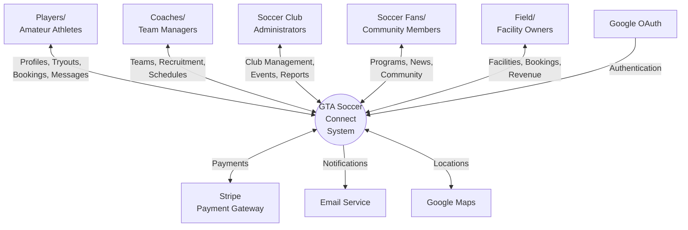

# GTA Soccer Connect
## High Level Requirements Document
**Version 1.0**  
**Date: September 23, 2025**

---

## Project Identification

| **Field** | **Details** |
|-----------|-------------|
| **Project:** | GTA Soccer Connect - Team 46 |
| **Prepared By:** | Soroush Salari |
| **Document Version:** | 1.0 |
| **Published Date:** | September 23, 2025 |

## Contributors

| **Name** | **Title** |
|----------|-----------|
| Soroush Salari | Technical Requirements Lead |
| Steven | Project Vision Lead |
| Laurence | Vision Collaborator & Meeting Manager |
| Kenan | User Experience Lead |
| Kathan | Quality Assurance Lead |

## Distribution

| **Name** | **Title** |
|----------|-----------|
| Course Instructor | COMP3059 Instructor |
| Team 46 Members | Development Team |
| Project Stakeholders | Advisory Board |

## Referenced Documents

| **Version** | **Title** | **Author** | **Date** | **Source/Location** |
|-------------|-----------|------------|----------|-------------------|
| 1.0 | Project Vision Document | Steven & Laurence | Sept 2025 | /templates/original/ |
| 1.0 | User Stories and Personas | Kenan | Sept 2025 | /templates/original/ |
| 1.0 | Project Summary | Steven | Sept 2025 | /templates/original/ |

## Revision History

| **Version Number** | **Revision Date** | **Summary of Changes** | **Modified by** |
|-------------------|-------------------|------------------------|-----------------|
| 0.1 | Sept 20, 2025 | Initial Draft | Soroush Salari |
| 0.5 | Sept 22, 2025 | Added functional requirements | Soroush Salari |
| 1.0 | Sept 23, 2025 | Final version with all requirements | Soroush Salari |

---

# TABLE OF CONTENTS

1. [Business Context Diagram](#business-context-diagram)
2. [Requirements Scope Statements](#requirements-scope-statements)
3. [Functional Requirements](#functional-requirements)
4. [Non-Functional Requirements](#non-functional-requirements)
5. [System Architecture](#system-architecture)
6. [Technology Stack](#technology-stack)
7. [Integration Requirements](#integration-requirements)
8. [Compliance and Accessibility](#compliance-and-accessibility)
9. [High Level Business Requirements Sign-Off](#high-level-business-requirements-sign-off)

---

## Business Context Diagram



### Requirement Scope Area

| **Requirement Scope Area** | **Description** |
|---------------------------|-----------------|
| GTA Soccer Connect Platform | Comprehensive soccer community platform connecting players, teams, facilities, and fans across the Greater Toronto Area |

### External Entities

| **External Entity** | **Description** |
|-------------------|-----------------|
| Amateur/Semi-Pro/Pro Players | Individual users seeking teams, tryouts, and playing opportunities |
| Team Coaches/Managers | Users responsible for team operations, recruitment, and management |
| Soccer Club Administrators | Users managing multiple teams, events, and club operations |
| Soccer Fans/Community Members | Users following teams, finding programs, and engaging with community |
| Field/Facility Owners | Users managing facility bookings, pricing, and maintenance |
| Payment Gateway Systems | External services for processing payments (Stripe, PayPal) |
| Location Services | External mapping and location APIs (Google Maps) |
| Social Media Platforms | External platforms for sharing and authentication |

### Information Flows

| **Information Flow** | **Description** |
|---------------------|-----------------|
| Player Registration Data | User profiles, skills, experience, availability flowing into system |
| Tryout Postings | Team requirements and tryout details from coaches to players |
| Booking Requests | Field reservation requests from users to facility owners |
| Payment Transactions | Financial data flowing between users and payment gateway |
| Location Data | GPS coordinates and mapping data for field locations |
| Chat Messages | Real-time communication between system users |
| Event Notifications | System alerts about tryouts, bookings, and updates |
| Performance Analytics | Player statistics and team performance data |

---

## Requirements Scope Statements

| **HLR#** | **Description** | **Priority** |
|----------|-----------------|--------------|
| HLR-001 | User registration and authentication system with role-based access (Player, Coach, Admin, Fan, Facility Owner) | H |
| HLR-002 | Comprehensive player profile system with stats, photos, videos, and skill showcases | H |
| HLR-003 | Tryout board for posting, discovering, and registering for team tryouts | H |
| HLR-004 | Field/facility booking system with real-time availability and payment processing | H |
| HLR-005 | Real-time messaging and chat system for individuals and groups | H |
| HLR-006 | Advanced search and filtering for players, teams, tryouts, and facilities | H |
| HLR-007 | Team management dashboard for rosters, schedules, and communications | H |
| HLR-008 | Payment processing for field bookings, registrations, and membership fees | H |
| HLR-009 | Event management system for tournaments, leagues, and community events | M |
| HLR-010 | Email notifications for tryouts, bookings, and updates | M |
| HLR-011 | Social features including team following and news feeds | M |
| HLR-012 | Staff/job marketplace for coaches and support personnel | M |
| HLR-013 | Youth program discovery and family-friendly activity finder | M |
| HLR-014 | Performance tracking and analytics for players and teams | L |
| HLR-015 | Community forums and discussion boards | L |
| HLR-016 | All user data must be encrypted | H |
| HLR-017 | HTTPS/SSL for all data transmissions | H |
| HLR-018 | Responsive web design supporting all modern browsers | H |
| HLR-019 | Multi-language support (English and French) | M |

---

## System Architecture

### Architecture Overview

The GTA Soccer Connect platform will utilize a **traditional three-tier architecture** suitable for a student capstone project, ensuring simplicity, maintainability, and ease of deployment.

```
┌─────────────────────────────────────────────────────────┐
│                   Frontend (Client)                      │
│  ┌───────────────────────────────────────────────┐      │
│  │          Next.js Application                  │      │
│  │    (React, Server-Side Rendering, Routing)    │      │
│  └───────────────────────────────────────────────┘      │
└─────────────────────────────────────────────────────────┘
                            │
                            ▼
┌─────────────────────────────────────────────────────────┐
│                  Backend API Layer                       │
│  ┌───────────────────────────────────────────────┐      │
│  │          .NET Core Web API                    │      │
│  │    (RESTful APIs, Authentication, SignalR)    │      │
│  └───────────────────────────────────────────────┘      │
└─────────────────────────────────────────────────────────┘
                            │
                            ▼
┌─────────────────────────────────────────────────────────┐
│                   Data Layer                            │
│  ┌───────────────────────────────────────────────┐      │
│  │          PostgreSQL Database                  │      │
│  │    (Primary data storage, relationships)      │      │
│  └───────────────────────────────────────────────┘      │
└─────────────────────────────────────────────────────────┘
```

### Key Architectural Components

| **Component** | **Description** | **Technology** |
|---------------|-----------------|----------------|
| Frontend Application | Responsive web application with SSR | Next.js 14+ |
| Backend API | RESTful API server with real-time capabilities | .NET Core 8.0 |
| Database | Primary relational database | PostgreSQL 15 |
| Caching | In-memory caching for performance | Redis |
| File Storage | Media files storage | Local storage / AWS S3 |
| Real-time Communication | WebSocket connections for chat | SignalR |
| Authentication | JWT-based authentication | ASP.NET Core Identity |
| Hosting | Deployment platform | Azure App Service / AWS EC2 |

---

## Technology Stack

### Frontend Technologies

| **Technology** | **Purpose** | **Justification** |
|----------------|-------------|-------------------|
| Next.js 14+ | Full-stack React framework | SSR, routing, API routes, production-ready |
| React 18 | UI library | Component-based, large ecosystem |
| TypeScript | Type-safe JavaScript | Better IDE support, fewer runtime errors |
| Tailwind CSS | Utility-first CSS | Rapid UI development, consistent design |
| Zustand/Redux Toolkit | State management | Simple, lightweight state management |
| Axios | HTTP client | Promise-based, interceptors, error handling |
| React Hook Form | Form handling | Performance, validation, minimal re-renders |
| SignalR Client | Real-time communication | Native .NET Core WebSocket integration |

### Backend Technologies

| **Technology** | **Purpose** | **Justification** |
|----------------|-------------|-------------------|
| .NET Core 8.0 | Backend framework | Cross-platform, high performance, mature ecosystem |
| ASP.NET Core Web API | RESTful API framework | Built-in features, middleware, routing |
| Entity Framework Core | ORM | Code-first approach, migrations, LINQ support |
| ASP.NET Core Identity | Authentication/Authorization | Built-in security, role management |
| SignalR | Real-time communication | WebSocket abstraction, automatic fallback |
| AutoMapper | Object mapping | DTO transformations, clean architecture |
| FluentValidation | Input validation | Declarative validation rules |
| Serilog | Structured logging | Rich logging, multiple sinks | 
| Swagger/OpenAPI | API documentation | Auto-generated docs, testing UI |

### Database Technologies

| **Technology** | **Purpose** | **Use Cases** |
|----------------|-------------|---------------|
| PostgreSQL 15 | Primary relational database | All application data with relationships |
| Redis | In-memory cache | Session storage, temporary data, caching |
| Entity Framework Core | ORM | Database migrations, LINQ queries |
| Npgsql | PostgreSQL driver | .NET Core PostgreSQL connectivity |

### Deployment & Infrastructure

| **Technology** | **Purpose** | **Justification** |
|----------------|-------------|-------------------|
| Azure App Service / AWS EC2 | Web hosting | Simple deployment, auto-scaling options |
| Azure Blob Storage / AWS S3 | File storage | Scalable object storage for media files |
| Azure SQL Database / AWS RDS | Managed PostgreSQL | Automated backups, high availability |
| GitHub Actions | CI/CD pipeline | Free for students, integrated with GitHub |
| Docker | Containerization | Consistent deployment environments |
| Nginx | Reverse proxy | Load balancing, SSL termination |

### Third-Party Services

| **Service** | **Purpose** | **Provider Options** |
|-------------|-------------|---------------------|
| Payment Processing | Handle financial transactions | Stripe API |
| Maps & Location | Basic venue location display | Google Maps Embed API (free tier) |
| Email Service | Transactional emails | SendGrid, SMTP |
| SMS Notifications | Text message alerts (optional) | Twilio |
| Error Monitoring | Application error tracking | Application Insights / Sentry |

---

## Integration Requirements

### Payment Gateway Integration

| **Requirement** | **Description** | **Priority** |
|-----------------|-----------------|--------------|
| INT-001 | Stripe API integration for credit/debit card processing | H |
| INT-002 | Support for recurring payments (memberships, subscriptions) | H |
| INT-003 | Split payment functionality for group field bookings | H |
| INT-004 | Refund processing for cancelled bookings | H |
| INT-005 | PCI DSS compliance for payment data handling | H |
| INT-006 | PayPal integration as alternative payment method | M |
| INT-007 | Digital wallet support (browser-based payments) | M |
| INT-008 | Invoice generation and receipt management | M |

### Location Services Integration

| **Requirement** | **Description** | **Priority** |
|-----------------|-----------------|--------------|
| INT-009 | Display venue addresses and basic map view | H |
| INT-010 | Store venue locations (address, city, postal code) | H |
| INT-011 | Basic distance calculation between postal codes | M |
| INT-012 | Simple map embed for venue location | L |

### Social Media Integration

| **Requirement** | **Description** | **Priority** |
|-----------------|-----------------|--------------|
| INT-014 | OAuth authentication with Google | H |
| INT-015 | Import basic profile data from Google account | M |

### Communication Integration

| **Requirement** | **Description** | **Priority** |
|-----------------|-----------------|--------------|
| INT-018 | Email service for notifications | H |
| INT-019 | SMS notifications for urgent updates (optional) | L |

### Monitoring and Logging

| **Requirement** | **Description** | **Priority** |
|-----------------|-----------------|--------------|
| INT-023 | Application performance monitoring | H |
| INT-024 | Error tracking and alerting | H |
| INT-025 | Structured logging for debugging | H |
| INT-026 | Health check endpoints | M |

---

---

## High Level Business Requirements Sign-Off

The undersigned acknowledge their agreement with the contents of Version 1.0 of the High-Level Requirements document for GTA Soccer Connect.

Following approval of this document, requirements changes will be governed by the project's change management process, including impact analysis and appropriate reviews and approvals, under the general control of the Project Plan and according to company policy. Approved Change Request Documents, if present, will be attached to this Requirements Document as updates.

| **Name** | **Project Role and Functional Area** | **Date Signed** |
|----------|--------------------------------------|-----------------|
| Soroush Salari | Technical Requirements Lead | September 23, 2025 |
| Steven | Project Vision Lead | |
| Laurence | Vision Collaborator & Meieting Manager | |
| Kenan | User Experience Lead | |
| Kathan | Quality Assurance Lead | |
| Course Instructor | Project Supervisor | |

*Note: Physical signatures are not required. Email approvals are acceptable and should be appended to project documents.*

---

**END OF DOCUMENT**

*Document Version: 1.0*  
*Last Updated: September 23, 2025*  
*Total Pages: 25*