# GTA Soccer Connect - Business Context Diagram

## Mermaid Context Diagram

```mermaid
graph TB
    %% Central System (Circle)
    System((GTA Soccer<br/>Connect<br/>System))
    
    %% External Entities (Rectangles)
    Player[Players/<br/>Amateur Athletes]
    Coach[Coaches/<br/>Team Managers]
    Admin[Soccer Club<br/>Administrators]
    Fan[Soccer Fans/<br/>Community Members]
    Owner[Field/<br/>Facility Owners]
    
    %% External Services
    Payment[Payment Gateway<br/>Stripe]
    Email[Email Service<br/>SendGrid]
    Auth[Google OAuth<br/>Authentication]
    Maps[Google Maps<br/>API]
    
    %% Data Flows - Users to System
    Player -->|Profile creation,<br/>Tryout registration,<br/>Field bookings| System
    System -->|Tryout notifications,<br/>Booking confirmations,<br/>Messages| Player
    
    Coach -->|Post tryouts,<br/>Manage teams,<br/>Scout players| System
    System -->|Player applications,<br/>Team updates,<br/>Schedule alerts| Coach
    
    Admin -->|Manage clubs,<br/>Create events,<br/>Financial data| System
    System -->|Reports,<br/>Member data,<br/>Analytics| Admin
    
    Fan -->|View teams,<br/>Find programs,<br/>Community posts| System
    System -->|Event updates,<br/>News feeds,<br/>Notifications| Fan
    
    Owner -->|List facilities,<br/>Set pricing,<br/>Manage availability| System
    System -->|Booking requests,<br/>Payment confirmations,<br/>Usage reports| Owner
    
    %% Data Flows - Services
    System -->|Process payments,<br/>Refunds| Payment
    Payment -->|Transaction status,<br/>Receipts| System
    
    System -->|Send notifications,<br/>Confirmations| Email
    Email -->|Delivery status| System
    
    Auth -->|User credentials,<br/>Profile data| System
    System -->|Authentication requests| Auth
    
    System -->|Location queries| Maps
    Maps -->|Venue locations,<br/>Map data| System
    
    %% Styling
    classDef systemStyle fill:#4A90E2,stroke:#2E5C8A,stroke-width:3px,color:#fff
    classDef userStyle fill:#50C878,stroke:#3A9B5C,stroke-width:2px,color:#fff
    classDef serviceStyle fill:#FF6B6B,stroke:#CC5555,stroke-width:2px,color:#fff
    
    class System systemStyle
    class Player,Coach,Admin,Fan,Owner userStyle
    class Payment,Email,Auth,Maps serviceStyle
```

## Context Diagram Components

### Central System
- **GTA Soccer Connect System**: The core web application that manages all soccer-related activities

### External Entities (Users)
1. **Players/Amateur Athletes**
   - Input: Profile information, tryout registrations, field booking requests
   - Output: Tryout opportunities, booking confirmations, team invitations

2. **Coaches/Team Managers**
   - Input: Tryout postings, team rosters, player recruitment
   - Output: Player applications, team analytics, schedule management

3. **Soccer Club Administrators**
   - Input: Club management, event creation, financial oversight
   - Output: Membership reports, revenue analytics, event coordination

4. **Soccer Fans/Community Members**
   - Input: Team following, program searches, community engagement
   - Output: Event notifications, news updates, program information

5. **Field/Facility Owners**
   - Input: Facility listings, pricing, availability management
   - Output: Booking requests, payment processing, utilization reports

### External Services
1. **Payment Gateway (Stripe)**
   - Handles all financial transactions and payment processing

2. **Email Service (SendGrid)**
   - Manages email notifications and communications

3. **Google OAuth**
   - Provides authentication and user profile data

4. **Google Maps API**
   - Supplies location data and map visualization

## How to Use This Diagram

This context diagram provides a high-level overview of:
- **Who** interacts with the system (external entities)
- **What** data flows between them (arrows with labels)
- **How** the system connects to external services

The diagram follows the standard context diagram format:
- Circle in center = Main system
- Rectangles = External entities
- Arrows = Data flow direction
- Labels = Type of data/interaction